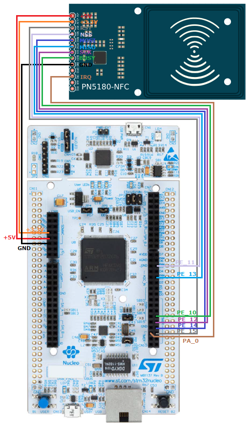

# Mbed PN5180

Mbed library for PN5180-NFC Module from NXP Semiconductors

## Release Notes

Version 1.3 - 16.05.2019

	* Removed Arduino compatibility
	* Added Mbed compatibility

## Forked from ATrappmann/PN5180-Library

fork reference: `git checkout origin-atrappmann`

Version 1.2 - 28.01.2019

	* Cleared Option bit in PN5180ISO15693::readSingleBlock and ::writeSingleBlock

Version 1.1 - 26.10.2018
	
	* Cleanup, bug fixing, refactoring
	* Automatic check for Arduino vs. ESP-32 platform via compiler switches
	* Added open pull requests
	* Working on documentation
	
Version 1.0.x - 21.09.2018

	* Initial versions
	
